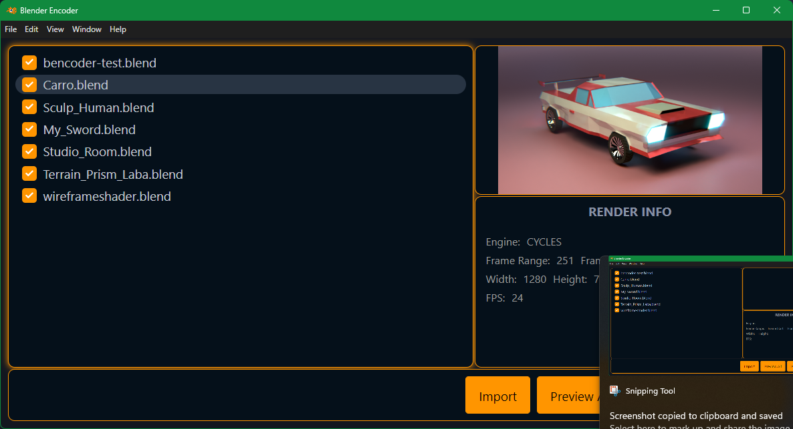

**Blender Encoder** is the most powerfull render manager for Blender3D. You can increase the speed of your workflow. Improves productivity in large projects that require dependent renders.

# Goals
- Provide a set of tools to facilitate the rendering of multiple files.
- Reduce render times.
- Control output settings for multiple files.
- Generate preview

# Screens
